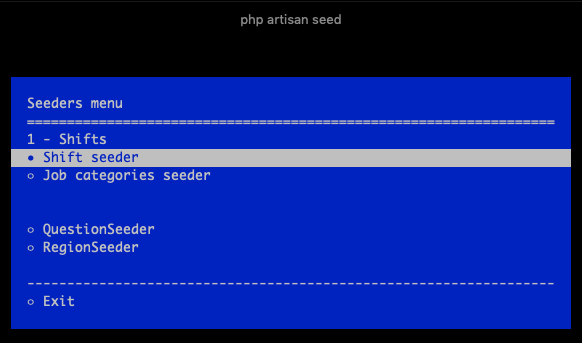

# Seeders on steroids

SeederPlus improves the seeder-driven workflow. 
It enables to easily & fast seed or reset a database to a certain state.



## Installation

[todo] publish maybe? 

You can install the package via composer:

```bash
composer require Temper/seederplus
```

## Usage

### Database setup
When dealing with a lot of migrations in large projects doing a `php artisan migrate:fresh` command might take a while. 
This package speeds this up, by making and storing a snapshot of the migrated database. This snapshot can then be restored without running all migrations again. 

To setup the db, run:  
``` bash
php artisan db:fresh
```
> caution! This will drop your current database. 

To reset the database to that fresh state,  simply run the same command again.

To force rebuilding of the snapshot, run:
``` bash
php artisan db:fresh --build
```

### Snapshots 
When your database is in a certain state, it can be helpfull to take a snapshot. When you want to go back to that specific state you can then reset the snaphot. 

#### Make a snapshot
To make a snapshot, run: 
``` bash
php artisan db:snap "snapshot name"
```
#### Restore a snapshot
To restore to your latest used/generated snapshot, run: 
``` bash
php artisan db:reset
```

To restore a specific snapshot, you can pass the name to the command. 
``` bash
php artisan db:reset "snapshot name"
```

#### List snapshots
You can list all your snapshots, and run or remove them by using
``` bash
php artisan db:snapshots
```

### Seeders

You can run a seeder by running the `php artisan seed` command, from this command you can select a seeder to run. 

To have a seeder appear in the menu, simply make it extend the SeederPlus class instead of the normal laravel Seeder class.  
A seeder can have a name and a section. Seeders are grouped by their section,  the name is displayed when listing. 

Example:
``` php 
<?php

use App\User;
use Temper\SeederPlus\SeederPlus;

class UsersSeeder extends SeederPlus
{

    protected $name = 'Users';

    protected $section = '1 - Most used';

    public $states = [
        AdminUserSeeder::class,
        'createTesterUser'
    ];

    public function run(): void
    {
        // Default
    }
    
    /**
     * @name Create a test user
     */
    public function createTesterUser(): void
    {
        // state seeder
    }
}
```

#### States
A seeder can have multiple states, for example a post seeder can have a published and unpublished post. 
A state can be defined as another seeder or as a function in the same class.

##### seeder class
Simply define the state in the states array. The class needs to extends the SeederPlus class as well. 

```php 
 public $states = [
    AdminUserSeeder::class,
];
```

##### function 
Its also possible to define functions for different states.
simply have function name in the states array. To define a name for the state, you can add a @name to the docblock. Otherwise just the function name will be used. 
  
``` php 
public $states = [
    'createTesterUser'
];

/**
 * @name Create a test user
 */
public function createTesterUser(): void
{
    // state seeder
}
```

### Relations

When a model has relationships it might be useful to use a already existing record instead of creating a new one.
To allow this, its possible to define what relationships the seeder might need. 

You can set a specific record to be used for a specific relation. To do this, run the relation command. 
``` bash
php artisan seed:relation
```
It is possible to configure other "resolvers" than just finding a record by id. For example when using hashIds, a implementation for the RelationFinderInterface could be made and could be added to the config `relation_finders`.
  
  #### using relations
  ```php
  public $relations = [
      'publisher' => User::class
  ];
  
  public function run()
  {
      $publisher = $this->relation('publisher', function() {
          return factory(User::class)->create();
      });
  }
  ```
  After defining the relation in the relations array using a name and the class you can use them in your seeder. 
  The `relation` function returns the relation model when the relation is configured, when the relation is not configured it uses the callback. 
